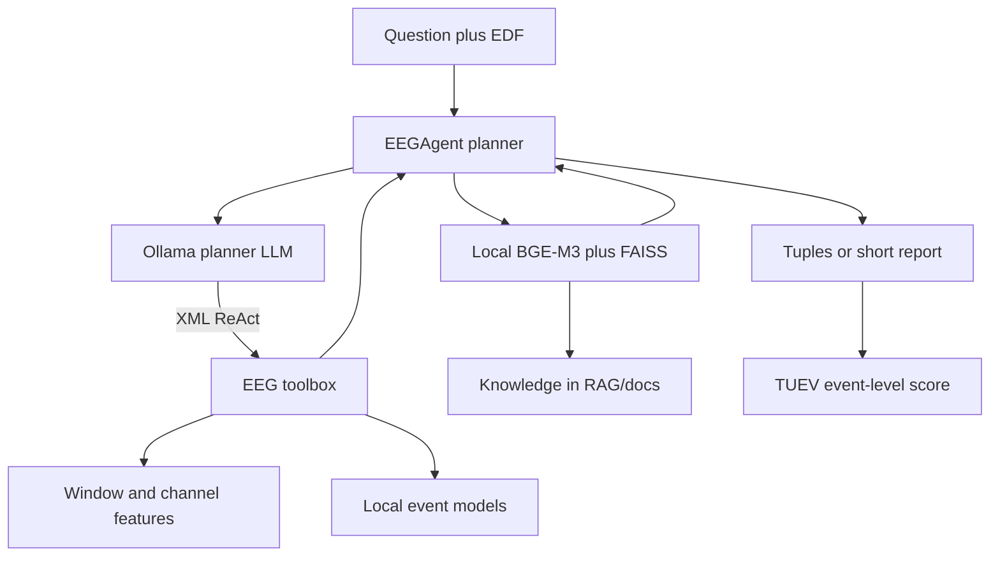
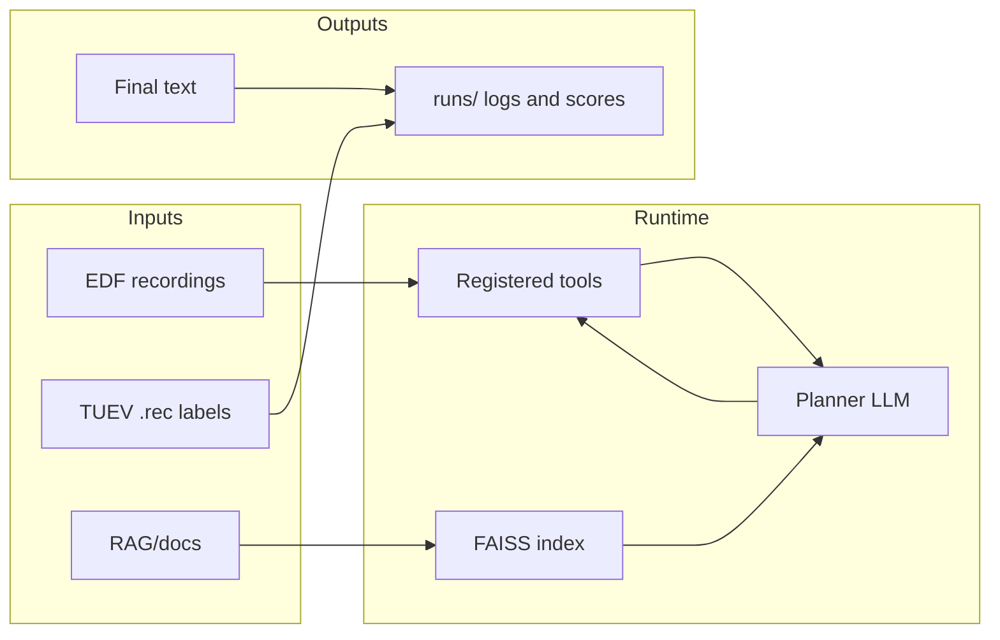
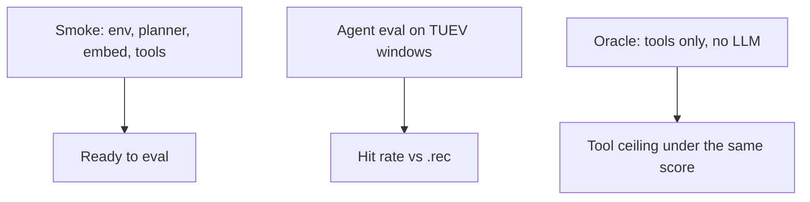

# EEGAgent at a glance

EEGAgent is a planner-plus-toolbox system for EEG analysis. An LLM chooses tools, reads their scores, and writes a short answer (events, stages, or a report). Local models do the signal work. The LLM does not replace those models.

## Who talks to whom

- **Planner** (`main.py` + `.env`): OpenAI-compatible chat to local Ollama or Ollama Cloud. It speaks the paper’s `<FUNCTION>` / `<ARGS>` loop, not native tool-calling.
- **Toolbox** (`tools/`): load/preprocess EDF, window features, and small PyTorch detectors (normal/abnormal, coarse 10 s, 1 s seizure, artifact type, sleep, MDD).
- **RAG** (`RAG/`): local `bge-m3` embeddings and a FAISS index over files in `RAG/docs`. This is the knowledge base, not the project `docs/` folder.
- **Eval**: `TUEV_eval.py` runs the agent on official TUEV pairs; `TUEV_oracle_run.py` runs tools only; `Sleep_eval.py` / `MDD_eval.py` cover the other public tasks.

## Where data lives

| Location | Role |
| --- | --- |
| `D:\Datasets\TUH-EEG\TUEV` and `TUAB` | External datasets. Read-only. |
| `data/` | Small in-repo samples for smoke tests. |
| `tools/localModels/*.pth` | Detector weights. |
| `RAG/docs`, `RAG/faiss.index` | Knowledge the agent can retrieve. |
| `runs/` | Generated eval logs. Gitignored. Recreate with the eval scripts. |
| `docs/` | Human runbook and this map. Not used at runtime. |

## Three ways to check the system

1. **Smoke** — is Ollama up, is `bge-m3` answering, do tools load? See [Note.md](Note.md).
2. **Agent eval** — the planner must pick tools and emit `(channel, start, end)` tuples. Scored against TUEV labels with overlap 0.7 after merging nearby reports.
3. **Oracle** — same score, but the script calls the seizure tools itself. Use this to separate “the detector missed” from “the LLM did not call the right tool”.

## Design that stays fixed

The live path is XML ReAct, a discharge-tool subset for TUEV, and gated extras for MiniMax (tool results as a user turn) and Qwen3.8 (continue-after-tools). Those are runtime contracts, not leftovers from a one-off experiment.

How to run and switch models: [Note.md](Note.md).
