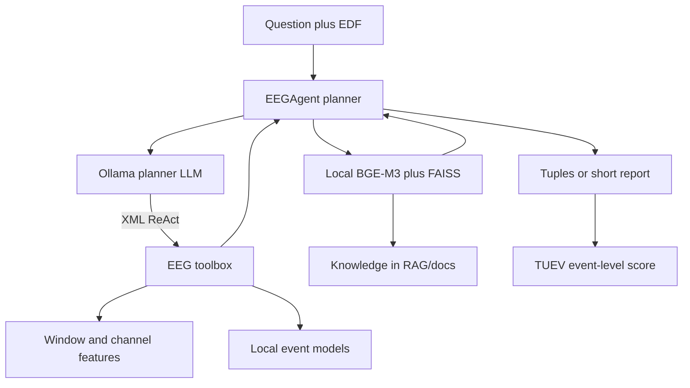
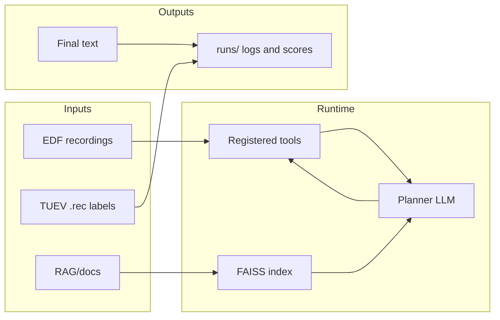
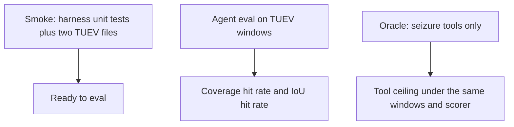

# EEGAgent at a glance

EEGAgent is a planner-plus-toolbox system for EEG analysis. An LLM chooses tools, reads their scores, and writes a short answer. Local models do the signal work. The LLM does not replace those models.

```mermaid
flowchart TB
  user[Question plus EDF] --> agent[EEGAgent planner]
  agent --> llm[Ollama planner LLM]
  llm -->|XML ReAct| tools[EEG toolbox]
  tools --> windows[Window and channel features]
  tools --> detectors[Local event models]
  agent --> rag[Local BGE-M3 plus FAISS]
  rag --> kb[Knowledge in RAG/docs]
  tools --> agent
  rag --> agent
  agent --> report[Tuples or short report]
  report --> score[TUEV event-level score]
```

## Who talks to whom

- **Planner** (`main.py`, `.env`, `config/protocols/tuev_authors_v2.json`): OpenAI-compatible chat. The TUEV baseline speaks the authors' `<FUNCTION>` / `<ARGS>` loop. Tool results come back as a user turn. Generation stops at `<RETURN>`.
- **Toolbox** (`tools/`): load and preprocess EDF, window features, and the PyTorch detectors.
- **RAG** (`RAG/`): `bge-m3` embeddings and a FAISS index over `RAG/docs`. This is the knowledge base, not the project `docs/` folder.
- **Eval**: `TUEV_eval.py` runs the agent. `TUEV_oracle_run.py` calls seizure tools on the same windows and scores them with `utils/tuev_metrics.py`. `Sleep_eval.py` and `MDD_eval.py` are not on the live agent path. Their loaders in `main.py` are commented out.

```mermaid
flowchart LR
  subgraph inputs [Inputs]
    edf[EDF recordings]
    rec[TUEV .rec labels]
    kb[RAG/docs]
  end
  subgraph core [Runtime]
    planner[Planner LLM]
    toolbox[Registered tools]
    index[FAISS index]
  end
  subgraph outputs [Outputs]
    answer[Final text]
    runs[runs/ logs and scores]
  end
  edf --> toolbox
  kb --> index
  planner --> toolbox
  toolbox --> planner
  index --> planner
  rec --> runs
  answer --> runs
```

## Where data lives

| Location | Role |
| --- | --- |
| `TUEV_DATA_DIR` in `.env` | Official TUEV eval split. Read-only. |
| `data/` | Small in-repo samples for smoke tests. |
| `tools/localModels/*.pth` | Detector weights. |
| `RAG/docs`, `RAG/faiss.index` | Knowledge the agent can retrieve. |
| `runs/` | Generated eval logs. Gitignored. |
| `docs/` | Runbook and notes. Not used at runtime. |
| `config/protocols/` | Frozen TUEV protocol. |

## Three ways to check the system

```mermaid
flowchart TD
  smoke[Smoke: harness unit tests plus two TUEV files] --> ready[Ready to eval]
  agentEval[Agent eval on TUEV windows] --> hit[Coverage hit rate and IoU hit rate]
  oracle[Oracle: seizure tools only] --> ceiling[Tool ceiling under the same windows and scorer]
```

1. **Smoke** — `python scripts/baseline_smoke.py`. See [Note.md](Note.md).
2. **Agent eval** — the planner emits `(channel, start, end)` tuples. Scored against merged `.rec` events. The historical coverage rule is unchanged. Scorer v2 also reports IoU > 0.7.
3. **Oracle** — same windows and the same scorer. The script calls `seizureNormalModel_OneSecond` or `seizureArtiBckgModel_OneSecond` itself. That separates a detector miss from a planner miss. The threshold is a flag, 0.5 or 0.7.

## What stays fixed for a comparison

The baseline protocol is `tuev_authors_v2`: the authors' question, every registered tool, and one harness for every planner. Model-name branches no longer change the prompt or where tool results are written. Ablations are explicit flags (`--harness`, `--prompt`, `--rag`, `--think`).

How to run it: [Note.md](Note.md). The frozen numbers and the runs still to do: [baseline.md](baseline.md).
