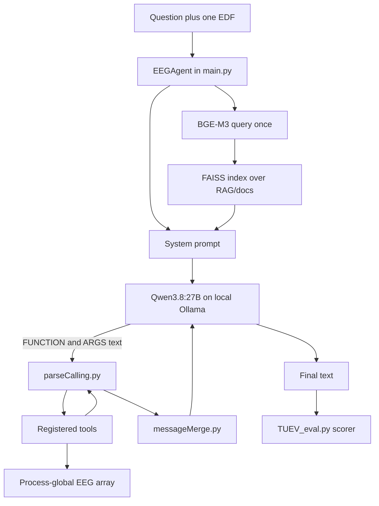

# Overview

EEGAgent answers an EEG question by letting a planner LLM call local tools. The tools score the signal. The planner does not replace them. This tree runs that loop on local Ollama. The default planner is `qwen3.8:27b`.

Paper: Zhao et al., arXiv:2511.09947. That paper's planner is Qwen3-235B on the DashScope API. The saved log is git `acd2e6a`. This tree does not start that client. See [pipelines.md](pipelines.md).

## Loop

`EEGAgent` in [main.py](../main.py) does one recording per process.

1. Load `config/config.json` and the EDF. The active loader is `dataLoad`: bandpass 0.5–70 Hz, notch 60 Hz, resample to 256 Hz, then up to 22 TCP bipolar pairs from [tools/polar.py](../tools/polar.py). `load_MDD_edf` and `load_Sleep_edf` exist and are commented out.
2. Store the array with `registerData`. Tools slice it by time. The planner never receives the waveform.
3. Read the EDF header with `baseInfo` (patient id, sex, age, start time, duration) and paste it into the system prompt. `baseInfo` is not a registered tool.
4. Build the prompt in [prompt.py](../prompt.py). `report_template` is loaded and then discarded. Age-band text from the config is included when the header has an age.
5. Embed the user question once. Append up to 3 chunks whose cosine similarity is at least 0.6 (`similarity_threshold` in `config/config.json`). Later rounds do not retrieve again.
6. Call the planner. The chat request has no native `tools` argument. Calls are `<FUNCTION>` / `<ARGS>` text, parsed by [utils/parseCalling.py](../utils/parseCalling.py). Results go back through [utils/messageMerge.py](../utils/messageMerge.py).
7. Stop after 8 rounds, or earlier when a non-empty reply has no tool call. Harness `authors_v2` retries one empty reply and, if round 8 is hit, takes one more tool-free turn.

## Where the pieces live

| Path | Role |
| --- | --- |
| [main.py](../main.py) | Agent loop |
| [prompt.py](../prompt.py) | `authors` and `strict` system prompts |
| [planner_adapt.py](../planner_adapt.py) | Harness flags, shared by every planner |
| [llm_settings.py](../llm_settings.py) | `.env` settings and the Ollama `/api/chat` client |
| [tuev_protocol.py](../tuev_protocol.py) | Frozen TUEV question, tools, harness, sampling |
| [tools/](../tools) | Preprocessing, features, and PyTorch detectors |
| [RAG/](../RAG) | Chunks, FAISS index, Ollama `bge-m3:latest` |
| [utils/tuev_metrics.py](../utils/tuev_metrics.py) | Coverage and IoU scoring |
| `config/protocols/` | Protocol JSON and the frozen authors' tool text |
| `runs/` | Eval logs. Not read at inference time |
| `docs/` | These notes. Not read at inference time |

`RAG/docs` is the knowledge base. This `docs/` folder is not.

## Registered tools

Imported when the `tools` package loads. The authors prompt shows the text frozen in [config/protocols/authors_tool_schemas.json](../config/protocols/authors_tool_schemas.json). The functions that run are the current files.

| Tool | What it returns |
| --- | --- |
| `normalAbnormalModel` | Whole-record normal vs abnormal |
| `slowSeizBckgModel_TenSeconds` | 10 s, all channels: background, slow, seizure |
| `seizureNormalModel_OneSecond` | 1 s, named channels: seizure vs non-seizure |
| `seizureArtiBckgModel_OneSecond` | 1 s, named channels: background, artifact, seizure |
| `eyemMuscleModel_OneSecond` | 1 s, named channels: eye movement vs muscle. No clean class |
| `compute_amplitude`, `compute_psd`, `compute_symmetry` | Window features, at most 60 s |
| `reflectData` | At most 1 s of raw samples |
| `sleepStageModel` | 30 s sleep stages |
| `healthMDDModel` | 5 s healthy vs MDD |

## Evaluation entry points

| Script | What it does |
| --- | --- |
| [TUEV_eval.py](../TUEV_eval.py) | Agent on paired `.edf` / `.rec` windows. Default protocol `tuev_authors_v2` |
| [TUEV_oracle_run.py](../TUEV_oracle_run.py) | Same windows and scorer, one 1 s seizure tool, no LLM |
| [scripts/rescore_tuev.py](../scripts/rescore_tuev.py) | Recompute scorer v2 from saved predictions |
| [scripts/baseline_smoke.py](../scripts/baseline_smoke.py) | Unit checks plus two live TUEV files |
| [scripts/smoke_test.py](../scripts/smoke_test.py) | Planner, embeddings, RAG, and tools, without the TUEV loop |
| [scripts/test_parse_calling.py](../scripts/test_parse_calling.py), [scripts/test_tuev_metrics.py](../scripts/test_tuev_metrics.py), [scripts/test_harness.py](../scripts/test_harness.py) | Parser, scorer, and harness checks |

`TUEV_eval.py` does not scan a whole recording. It merges `.rec` rows and asks only about those intervals. Times in the question are `round(start)` and `round(end)`. Positive classes for the hit rate are 1, 2, and 3 (SPSW, GPED, PLED in `TUEV/v2.0.1/AAREADME.txt`). Classes 4–6 (eye movement, artifact, background) are explicit negatives.

## Not on the live agent path

`Sleep_eval.py` and `MDD_eval.py` construct `EEGAgent`, but `main.py` always calls `dataLoad`. The sleep and MDD loaders are commented out, so those scripts do not feed the agent the montage those tasks expect.

`eval/sleep/` and `eval/MDD/` train the local stage and MDD networks. They are not the TUEV baseline.

## Read next

- How Qwen3.8:27B on local Ollama, Qwen3-235B on DashScope, and the earlier Qwen3.8:27B folder differ: [pipelines.md](pipelines.md)
- Protocol and headline numbers: [baseline.md](baseline.md)
- Full tables: [baseline_results.md](baseline_results.md)
- What those numbers do and do not support: [review.md](review.md)
